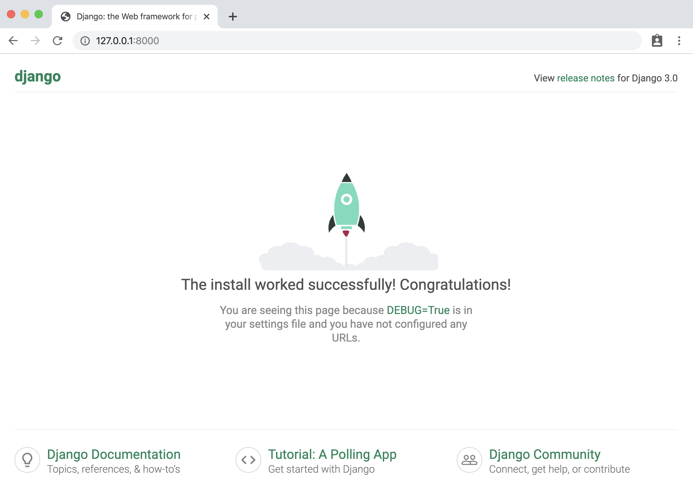

# Django eCommerce Projesi
## Django nedir ?
&nbsp;&nbsp;&nbsp;&nbsp;Django, web sitelerini backend kısmında uzun yıllardan beri kullanılan ve bu alandaki tek el olmuş öğrenmesi zor ve sadece backend dışında farklı alanlarda kullanılması zor olan PHP gibi dilllerin yerine; matematik, fizik, kimya, biyoloji, tıp, veri bilimi, siber güvenlik, otonom araç teknolojisi, hız gözetmeyen gömülü sistemler gibi birçoğu birbirinden bağımsız olan alanlarda da ortak olarak kullanılan Python dili ile web sitelerin backend kısmının halledilmesini sağlayan bir kütüphanedir. 

&nbsp;&nbsp;&nbsp;&nbsp;Yazılımcının, gereksiz yere öğrenmeye ve kullanmaya vaktini harcamasının önüne geçer.


## Sistemin Hazır Hale Getirilmesi
&nbsp;&nbsp;&nbsp;&nbsp;Django'yu kullanabilmek için bilgisayarımızda Python'ın güncel sürümleri yüklü olmalıdır.
Bunun için de; 

**Python Kurulması**

&nbsp;&nbsp;&nbsp;&nbsp;Eğer Windows kullanıyorsak; https://www.python.org/ sitesinden indirme yapabiliriz.

&nbsp;&nbsp;&nbsp;&nbsp;Eğer Debian/Ubuntu kullanıyorsak; işletim sisteminin terminal emülatörünü açıp;
```sh
~$ sudo apt-get install python3
```
komutunu kullanarak direk olarak kısa bir süre içinde sisteme en yeni sürüm python uygulamasını indirebiliriz.

**Pip kurulması**

&nbsp;&nbsp;&nbsp;&nbsp;Pip; "Python Package Index" adından türetilmiştir. Sistemimize terminal ekranından kolay yoldan kütüphane kurmamız konusunda bize yardımcı olur.

&nbsp;&nbsp;&nbsp;&nbsp;Eğer Windows kullanıyorsak;
google üzerinden [get-pip.py](https://www.google.com/url?sa=t&rct=j&q=&esrc=s&source=web&cd=&ved=2ahUKEwj6iLjUw5rqAhWDx4UKHbKuAoIQFjABegQIBRAB&url=https%3A%2F%2Fbootstrap.pypa.io%2Fget-pip.py&usg=AOvVaw0zKVO_zW0nkF7s0zdjWFNj) adındaki python dosyasını internetten indirip bilgisayarımızdaki kurulu olan python ile çalıştırmamız gerekmektedir.

&nbsp;&nbsp;&nbsp;&nbsp;Eğer debian/ubuntu kullanıyorsak; yine terminal ekranına yazacağımız

```sh
~$ sudo apt install python3-pip
```

komutu ile çok kısa süre içinde Python Package Index (pip) uygulamasını sistemimize indirebiliriz.

**Django ve Diğer Gerekli Kütüphanelerin Kurulması**

Windows kullanıyorsak cmd; ubuntu kullanıyorsak terminal ekranına;
```sh
`$ pip install django
```
komutunu yazarak django kütüphanesini sistemimize indirebiliriz. Diğer gerekli olan, django'ya bağımlılığı olan kütüphaneleri pip otomatik olarak indirecektir zaten. 

bu aşamalardan sonra sistemimiz django projemiz için hazır hale geldi.

## Django Projesine İlk Adım
&nbsp;&nbsp;&nbsp;&nbsp;Django projemizi indirdiğimiz django kütüphanesi aracılığı ile; üzerinde oynama yapılma ve tam anlamıyla çalışabilir hale gelmesine kadar yapılması gereken uzun, yorucu ve gereksiz vakit çalan kısımlarını;

Eğer Windows kullanıyorsak cmd ekranına; 
```sh
C:/Users/User/Masaüstü> django-admin.exe startproject ilkDjangoProjem .
```
komutu ile,

Eğer linux kullanıyorsak;
```sh
~/Masaüstü/$ django-admin startproject ilkDjangoProjem .
```
komutu ile hazır hale getirip zamandan kazanabiliriz.

Bu işlem bize komutu girdiğimiz dizin içinde;

```sh
Masaüstü/
|__ manage.py
|__ ilkDjangoProjem
	|__ settings.py
	|__ urls.py
	|__ wsgi.py
	|__ __init__.py
```

şeklinde düzenlenmiş olan bir Dizin Ağacı (Directory Tree) düzenleyecektir.

**Uygulamanın Çalıştırılması**

Temel olarak tamamlanmış olan bu projenin çalışıp çalışmadığını anlamak için ise **manage.py** dosyasını kullanacağız. Bunu da;

```sh
~/Masaüstü/$ python manage.py runserver
```
komutu ile çalıştırarak yaparız. Bu komut sitemizi localhostta açar. Localhostun adresi ise öntanımlı olarak <text>http://127.0.0.1:8000/<text>'dır. Yani sistemdeki 8000. portta sitemizi çalışır hale getirmiş oluyor. Bu komuttan sonra tarayıcımızda göreceğimiz ekran ise şöyledir;

&nbsp;&nbsp;&nbsp;&nbsp;&nbsp;&nbsp;&nbsp;&nbsp;&nbsp;&nbsp;&nbsp;&nbsp;&nbsp;&nbsp;&nbsp;&nbsp;&nbsp;&nbsp;&nbsp;&nbsp;

Tüm bu aşamaları başarılı bir şekilde tamamladıktan sonra uygulamamız tamamen üzerinde oynama yapılabilir hale gelmiş oluyor.
